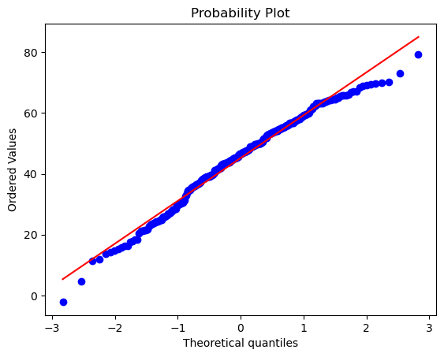

# Team_25_DS4A_Economic Data Models_Original

# Import Mass Killing Data and Tools


```python
#Install Requirements via Text File
!pip install -r requirements.txt

#Import the packages for cleaning, analysis, and visualization 

import json
import pandas as pd
import matplotlib.pyplot as plt
import seaborn as sns
import numpy as np
import scipy.stats as stats
import pandas_profiling as pp
from pandas_profiling import ProfileReport
from pandasql import sqldf
from sklearn import preprocessing
from sklearn.preprocessing import LabelEncoder, OneHotEncoder
from statsmodels.formula.api import ols
import statsmodels.api as smf
```

    Collecting https://github.com/pandas-profiling/pandas-profiling/archive/master.zip (from -r requirements.txt (line 8))
      Using cached https://github.com/pandas-profiling/pandas-profiling/archive/master.zip
      Preparing metadata (setup.py) ... [?25ldone
    [?25hRequirement already satisfied: pandas in /Users/kashundavis/opt/anaconda3/lib/python3.9/site-packages (from -r requirements.txt (line 1)) (1.4.4)
    Requirement already satisfied: numpy in /Users/kashundavis/opt/anaconda3/lib/python3.9/site-packages (from -r requirements.txt (line 2)) (1.21.5)
    Requirement already satisfied: scipy in /Users/kashundavis/opt/anaconda3/lib/python3.9/site-packages (from -r requirements.txt (line 3)) (1.9.1)
    Requirement already satisfied: matplotlib in /Users/kashundavis/opt/anaconda3/lib/python3.9/site-packages (from -r requirements.txt (line 4)) (3.5.2)
    Requirement already satisfied: seaborn==v0.11.2 in /Users/kashundavis/opt/anaconda3/lib/python3.9/site-packages (from -r requirements.txt (line 5)) (0.11.2)
    Requirement already satisfied: pingouin in /Users/kashundavis/opt/anaconda3/lib/python3.9/site-packages (from -r requirements.txt (line 6)) (0.5.3)
    Requirement already satisfied: pivottablejs in /Users/kashundavis/opt/anaconda3/lib/python3.9/site-packages (from -r requirements.txt (line 7)) (0.9.0)
    Requirement already satisfied: sqlalchemy==1.4.46 in /Users/kashundavis/opt/anaconda3/lib/python3.9/site-packages (from -r requirements.txt (line 9)) (1.4.46)
    Requirement already satisfied: ipython-sql in /Users/kashundavis/opt/anaconda3/lib/python3.9/site-packages (from -r requirements.txt (line 10)) (0.4.1)
    Requirement already satisfied: pandasql in /Users/kashundavis/opt/anaconda3/lib/python3.9/site-packages (from -r requirements.txt (line 11)) (0.7.3)
    Requirement already satisfied: greenlet!=0.4.17 in /Users/kashundavis/opt/anaconda3/lib/python3.9/site-packages (from sqlalchemy==1.4.46->-r requirements.txt (line 9)) (1.1.1)
    Requirement already satisfied: python-dateutil>=2.8.1 in /Users/kashundavis/opt/anaconda3/lib/python3.9/site-packages (from pandas->-r requirements.txt (line 1)) (2.8.2)
    Requirement already satisfied: pytz>=2020.1 in /Users/kashundavis/opt/anaconda3/lib/python3.9/site-packages (from pandas->-r requirements.txt (line 1)) (2022.1)
    Requirement already satisfied: packaging>=20.0 in /Users/kashundavis/opt/anaconda3/lib/python3.9/site-packages (from matplotlib->-r requirements.txt (line 4)) (21.3)
    Requirement already satisfied: fonttools>=4.22.0 in /Users/kashundavis/opt/anaconda3/lib/python3.9/site-packages (from matplotlib->-r requirements.txt (line 4)) (4.25.0)
    Requirement already satisfied: kiwisolver>=1.0.1 in /Users/kashundavis/opt/anaconda3/lib/python3.9/site-packages (from matplotlib->-r requirements.txt (line 4)) (1.4.2)
    Requirement already satisfied: pillow>=6.2.0 in /Users/kashundavis/opt/anaconda3/lib/python3.9/site-packages (from matplotlib->-r requirements.txt (line 4)) (9.2.0)
    Requirement already satisfied: pyparsing>=2.2.1 in /Users/kashundavis/opt/anaconda3/lib/python3.9/site-packages (from matplotlib->-r requirements.txt (line 4)) (3.0.9)
    Requirement already satisfied: cycler>=0.10 in /Users/kashundavis/opt/anaconda3/lib/python3.9/site-packages (from matplotlib->-r requirements.txt (line 4)) (0.11.0)
    Requirement already satisfied: pandas-flavor>=0.2.0 in /Users/kashundavis/opt/anaconda3/lib/python3.9/site-packages (from pingouin->-r requirements.txt (line 6)) (0.5.0)
    Requirement already satisfied: statsmodels>=0.13 in /Users/kashundavis/opt/anaconda3/lib/python3.9/site-packages (from pingouin->-r requirements.txt (line 6)) (0.13.2)
    Requirement already satisfied: outdated in /Users/kashundavis/opt/anaconda3/lib/python3.9/site-packages (from pingouin->-r requirements.txt (line 6)) (0.2.2)
    Requirement already satisfied: tabulate in /Users/kashundavis/opt/anaconda3/lib/python3.9/site-packages (from pingouin->-r requirements.txt (line 6)) (0.8.10)
    Requirement already satisfied: scikit-learn in /Users/kashundavis/opt/anaconda3/lib/python3.9/site-packages (from pingouin->-r requirements.txt (line 6)) (1.0.2)
    Requirement already satisfied: pydantic<1.11,>=1.8.1 in /Users/kashundavis/opt/anaconda3/lib/python3.9/site-packages (from ydata-profiling==0.0.dev0->-r requirements.txt (line 8)) (1.10.4)
    Requirement already satisfied: PyYAML<6.1,>=5.0.0 in /Users/kashundavis/opt/anaconda3/lib/python3.9/site-packages (from ydata-profiling==0.0.dev0->-r requirements.txt (line 8)) (6.0)
    Requirement already satisfied: jinja2<3.2,>=2.11.1 in /Users/kashundavis/opt/anaconda3/lib/python3.9/site-packages (from ydata-profiling==0.0.dev0->-r requirements.txt (line 8)) (2.11.3)
    Requirement already satisfied: visions[type_image_path]==0.7.5 in /Users/kashundavis/opt/anaconda3/lib/python3.9/site-packages (from ydata-profiling==0.0.dev0->-r requirements.txt (line 8)) (0.7.5)
    Requirement already satisfied: htmlmin==0.1.12 in /Users/kashundavis/opt/anaconda3/lib/python3.9/site-packages (from ydata-profiling==0.0.dev0->-r requirements.txt (line 8)) (0.1.12)
    Requirement already satisfied: phik<0.13,>=0.11.1 in /Users/kashundavis/opt/anaconda3/lib/python3.9/site-packages (from ydata-profiling==0.0.dev0->-r requirements.txt (line 8)) (0.12.3)
    Requirement already satisfied: requests<2.29,>=2.24.0 in /Users/kashundavis/opt/anaconda3/lib/python3.9/site-packages (from ydata-profiling==0.0.dev0->-r requirements.txt (line 8)) (2.28.1)
    Requirement already satisfied: tqdm<4.65,>=4.48.2 in /Users/kashundavis/opt/anaconda3/lib/python3.9/site-packages (from ydata-profiling==0.0.dev0->-r requirements.txt (line 8)) (4.64.1)
    Requirement already satisfied: multimethod<1.10,>=1.4 in /Users/kashundavis/opt/anaconda3/lib/python3.9/site-packages (from ydata-profiling==0.0.dev0->-r requirements.txt (line 8)) (1.9.1)
    Requirement already satisfied: typeguard<2.14,>=2.13.2 in /Users/kashundavis/opt/anaconda3/lib/python3.9/site-packages (from ydata-profiling==0.0.dev0->-r requirements.txt (line 8)) (2.13.3)
    Requirement already satisfied: attrs>=19.3.0 in /Users/kashundavis/opt/anaconda3/lib/python3.9/site-packages (from visions[type_image_path]==0.7.5->ydata-profiling==0.0.dev0->-r requirements.txt (line 8)) (21.4.0)
    Requirement already satisfied: networkx>=2.4 in /Users/kashundavis/opt/anaconda3/lib/python3.9/site-packages (from visions[type_image_path]==0.7.5->ydata-profiling==0.0.dev0->-r requirements.txt (line 8)) (2.8.4)
    Requirement already satisfied: tangled-up-in-unicode>=0.0.4 in /Users/kashundavis/opt/anaconda3/lib/python3.9/site-packages (from visions[type_image_path]==0.7.5->ydata-profiling==0.0.dev0->-r requirements.txt (line 8)) (0.2.0)
    Requirement already satisfied: imagehash in /Users/kashundavis/opt/anaconda3/lib/python3.9/site-packages (from visions[type_image_path]==0.7.5->ydata-profiling==0.0.dev0->-r requirements.txt (line 8)) (4.3.1)
    Requirement already satisfied: six in /Users/kashundavis/opt/anaconda3/lib/python3.9/site-packages (from ipython-sql->-r requirements.txt (line 10)) (1.16.0)
    Requirement already satisfied: sqlparse in /Users/kashundavis/opt/anaconda3/lib/python3.9/site-packages (from ipython-sql->-r requirements.txt (line 10)) (0.4.3)
    Requirement already satisfied: ipython>=1.0 in /Users/kashundavis/opt/anaconda3/lib/python3.9/site-packages (from ipython-sql->-r requirements.txt (line 10)) (7.31.1)
    Requirement already satisfied: ipython-genutils>=0.1.0 in /Users/kashundavis/opt/anaconda3/lib/python3.9/site-packages (from ipython-sql->-r requirements.txt (line 10)) (0.2.0)
    Requirement already satisfied: prettytable<1 in /Users/kashundavis/opt/anaconda3/lib/python3.9/site-packages (from ipython-sql->-r requirements.txt (line 10)) (0.7.2)
    Requirement already satisfied: backcall in /Users/kashundavis/opt/anaconda3/lib/python3.9/site-packages (from ipython>=1.0->ipython-sql->-r requirements.txt (line 10)) (0.2.0)
    Requirement already satisfied: prompt-toolkit!=3.0.0,!=3.0.1,<3.1.0,>=2.0.0 in /Users/kashundavis/opt/anaconda3/lib/python3.9/site-packages (from ipython>=1.0->ipython-sql->-r requirements.txt (line 10)) (3.0.20)
    Requirement already satisfied: pygments in /Users/kashundavis/opt/anaconda3/lib/python3.9/site-packages (from ipython>=1.0->ipython-sql->-r requirements.txt (line 10)) (2.11.2)
    Requirement already satisfied: pickleshare in /Users/kashundavis/opt/anaconda3/lib/python3.9/site-packages (from ipython>=1.0->ipython-sql->-r requirements.txt (line 10)) (0.7.5)
    Requirement already satisfied: matplotlib-inline in /Users/kashundavis/opt/anaconda3/lib/python3.9/site-packages (from ipython>=1.0->ipython-sql->-r requirements.txt (line 10)) (0.1.6)
    Requirement already satisfied: decorator in /Users/kashundavis/opt/anaconda3/lib/python3.9/site-packages (from ipython>=1.0->ipython-sql->-r requirements.txt (line 10)) (5.1.1)
    Requirement already satisfied: pexpect>4.3 in /Users/kashundavis/opt/anaconda3/lib/python3.9/site-packages (from ipython>=1.0->ipython-sql->-r requirements.txt (line 10)) (4.8.0)
    Requirement already satisfied: traitlets>=4.2 in /Users/kashundavis/opt/anaconda3/lib/python3.9/site-packages (from ipython>=1.0->ipython-sql->-r requirements.txt (line 10)) (5.1.1)
    Requirement already satisfied: jedi>=0.16 in /Users/kashundavis/opt/anaconda3/lib/python3.9/site-packages (from ipython>=1.0->ipython-sql->-r requirements.txt (line 10)) (0.18.1)
    Requirement already satisfied: appnope in /Users/kashundavis/opt/anaconda3/lib/python3.9/site-packages (from ipython>=1.0->ipython-sql->-r requirements.txt (line 10)) (0.1.2)
    Requirement already satisfied: setuptools>=18.5 in /Users/kashundavis/opt/anaconda3/lib/python3.9/site-packages (from ipython>=1.0->ipython-sql->-r requirements.txt (line 10)) (63.4.1)
    Requirement already satisfied: MarkupSafe>=0.23 in /Users/kashundavis/opt/anaconda3/lib/python3.9/site-packages (from jinja2<3.2,>=2.11.1->ydata-profiling==0.0.dev0->-r requirements.txt (line 8)) (2.0.1)
    Requirement already satisfied: lazy-loader>=0.1 in /Users/kashundavis/opt/anaconda3/lib/python3.9/site-packages (from pandas-flavor>=0.2.0->pingouin->-r requirements.txt (line 6)) (0.1)
    Requirement already satisfied: xarray in /Users/kashundavis/opt/anaconda3/lib/python3.9/site-packages (from pandas-flavor>=0.2.0->pingouin->-r requirements.txt (line 6)) (0.20.1)
    Requirement already satisfied: joblib>=0.14.1 in /Users/kashundavis/opt/anaconda3/lib/python3.9/site-packages (from phik<0.13,>=0.11.1->ydata-profiling==0.0.dev0->-r requirements.txt (line 8)) (1.1.0)
    Requirement already satisfied: typing-extensions>=4.2.0 in /Users/kashundavis/opt/anaconda3/lib/python3.9/site-packages (from pydantic<1.11,>=1.8.1->ydata-profiling==0.0.dev0->-r requirements.txt (line 8)) (4.3.0)
    Requirement already satisfied: certifi>=2017.4.17 in /Users/kashundavis/opt/anaconda3/lib/python3.9/site-packages (from requests<2.29,>=2.24.0->ydata-profiling==0.0.dev0->-r requirements.txt (line 8)) (2022.9.24)
    Requirement already satisfied: charset-normalizer<3,>=2 in /Users/kashundavis/opt/anaconda3/lib/python3.9/site-packages (from requests<2.29,>=2.24.0->ydata-profiling==0.0.dev0->-r requirements.txt (line 8)) (2.0.4)
    Requirement already satisfied: urllib3<1.27,>=1.21.1 in /Users/kashundavis/opt/anaconda3/lib/python3.9/site-packages (from requests<2.29,>=2.24.0->ydata-profiling==0.0.dev0->-r requirements.txt (line 8)) (1.26.11)
    Requirement already satisfied: idna<4,>=2.5 in /Users/kashundavis/opt/anaconda3/lib/python3.9/site-packages (from requests<2.29,>=2.24.0->ydata-profiling==0.0.dev0->-r requirements.txt (line 8)) (3.3)
    Requirement already satisfied: patsy>=0.5.2 in /Users/kashundavis/opt/anaconda3/lib/python3.9/site-packages (from statsmodels>=0.13->pingouin->-r requirements.txt (line 6)) (0.5.2)
    Requirement already satisfied: littleutils in /Users/kashundavis/opt/anaconda3/lib/python3.9/site-packages (from outdated->pingouin->-r requirements.txt (line 6)) (0.2.2)
    Requirement already satisfied: threadpoolctl>=2.0.0 in /Users/kashundavis/opt/anaconda3/lib/python3.9/site-packages (from scikit-learn->pingouin->-r requirements.txt (line 6)) (2.2.0)
    Requirement already satisfied: parso<0.9.0,>=0.8.0 in /Users/kashundavis/opt/anaconda3/lib/python3.9/site-packages (from jedi>=0.16->ipython>=1.0->ipython-sql->-r requirements.txt (line 10)) (0.8.3)
    Requirement already satisfied: ptyprocess>=0.5 in /Users/kashundavis/opt/anaconda3/lib/python3.9/site-packages (from pexpect>4.3->ipython>=1.0->ipython-sql->-r requirements.txt (line 10)) (0.7.0)
    Requirement already satisfied: wcwidth in /Users/kashundavis/opt/anaconda3/lib/python3.9/site-packages (from prompt-toolkit!=3.0.0,!=3.0.1,<3.1.0,>=2.0.0->ipython>=1.0->ipython-sql->-r requirements.txt (line 10)) (0.2.5)
    Requirement already satisfied: PyWavelets in /Users/kashundavis/opt/anaconda3/lib/python3.9/site-packages (from imagehash->visions[type_image_path]==0.7.5->ydata-profiling==0.0.dev0->-r requirements.txt (line 8)) (1.3.0)


    /var/folders/f0/cswv940s1pl9lnmr89n7jvkm0000gn/T/ipykernel_78488/2781247489.py:12: DeprecationWarning: `import pandas_profiling` is going to be deprecated by April 1st. Please use `import ydata_profiling` instead.
      import pandas_profiling as pp


```python
#Read the data file into a dataframe
with open('data/mass_killing_incidents_public.csv') as f:
    mki=pd.read_csv(f, delimiter=',')
with open('data/mass_killing_offenders_public.csv') as f:
    mko=pd.read_csv(f, delimiter=',')
with open('data/mass_killing_victims_public.csv') as f:
    mkv=pd.read_csv(f, delimiter=',')
with open('data/mass_killing_weapons_public.csv') as f:
    mkw=pd.read_csv(f, delimiter=',')

# Source and Definitions: https://data.world/associatedpress/mass-killings-public/workspace/file?filename=MKA+Public+Data+Codebook.pdf

```


```python
# Importing Life Expectancy Data for the U.S. by Gender
with open('data/le/U.S._State_Life_Expectancy_by_Sex__2020.csv') as f:
    le=pd.read_csv(f, delimiter=',')

# Want to plot Life Expectancy for US for 2020
```


```python
# US State to Abbreviations
us_state_to_abbrev = {
    "Alabama": "AL",
    "Alaska": "AK",
    "Arizona": "AZ",
    "Arkansas": "AR",
    "California": "CA",
    "Colorado": "CO",
    "Connecticut": "CT",
    "Delaware": "DE",
    "Florida": "FL",
    "Georgia": "GA",
    "Hawaii": "HI",
    "Idaho": "ID",
    "Illinois": "IL",
    "Indiana": "IN",
    "Iowa": "IA",
    "Kansas": "KS",
    "Kentucky": "KY",
    "Louisiana": "LA",
    "Maine": "ME",
    "Maryland": "MD",
    "Massachusetts": "MA",
    "Michigan": "MI",
    "Minnesota": "MN",
    "Mississippi": "MS",
    "Missouri": "MO",
    "Montana": "MT",
    "Nebraska": "NE",
    "Nevada": "NV",
    "New Hampshire": "NH",
    "New Jersey": "NJ",
    "New Mexico": "NM",
    "New York": "NY",
    "North Carolina": "NC",
    "North Dakota": "ND",
    "Ohio": "OH",
    "Oklahoma": "OK",
    "Oregon": "OR",
    "Pennsylvania": "PA",
    "Rhode Island": "RI",
    "South Carolina": "SC",
    "South Dakota": "SD",
    "Tennessee": "TN",
    "Texas": "TX",
    "Utah": "UT",
    "Vermont": "VT",
    "Virginia": "VA",
    "Washington": "WA",
    "West Virginia": "WV",
    "Wisconsin": "WI",
    "Wyoming": "WY",
    "District of Columbia": "DC",
    "American Samoa": "AS",
    "Guam": "GU",
    "Northern Mariana Islands": "MP",
    "Puerto Rico": "PR",
    "United States Minor Outlying Islands": "UM",
    "U.S. Virgin Islands": "VI",
}

abbv_to_states = dict(zip(us_state_to_abbrev.values(), us_state_to_abbrev.keys()))

states_to_regions = {
    'Washington': 'West', 'Oregon': 'West', 'California': 'West', 'Nevada': 'West',
    'Idaho': 'West', 'Montana': 'West', 'Wyoming': 'West', 'Utah': 'West',
    'Colorado': 'West', 'Alaska': 'West', 'Hawaii': 'West', 'Maine': 'Northeast',
    'Vermont': 'Northeast', 'New York': 'Northeast', 'New Hampshire': 'Northeast',
    'Massachusetts': 'Northeast', 'Rhode Island': 'Northeast', 'Connecticut': 'Northeast',
    'New Jersey': 'Northeast', 'Pennsylvania': 'Northeast', 'North Dakota': 'Midwest',
    'South Dakota': 'Midwest', 'Nebraska': 'Midwest', 'Kansas': 'Midwest',
    'Minnesota': 'Midwest', 'Iowa': 'Midwest', 'Missouri': 'Midwest', 'Wisconsin': 'Midwest',
    'Illinois': 'Midwest', 'Michigan': 'Midwest', 'Indiana': 'Midwest', 'Ohio': 'Midwest',
    'West Virginia': 'South', 'District of Columbia': 'South', 'Maryland': 'South',
    'Virginia': 'South', 'Kentucky': 'South', 'Tennessee': 'South', 'North Carolina': 'South',
    'Mississippi': 'South', 'Arkansas': 'South', 'Louisiana': 'South', 'Alabama': 'South',
    'Georgia': 'South', 'South Carolina': 'South', 'Florida': 'South', 'Delaware': 'South',
    'Arizona': 'Southwest', 'New Mexico': 'Southwest', 'Oklahoma': 'Southwest',
    'Texas': 'Southwest'}

regions_to_states = dict(zip(states_to_regions.values(), states_to_regions.keys()))

month_season = {
    1:'winter', 2:'winter',3:'spring',4:'spring',5:'spring',6:'summer',
    7:'summer',8:'summer',9:'fall',10:'fall',11:'fall',12:'winter'
}
```


```python
# Merging of Incidents and Victim Tables
# Query definition
mki_mkv_q = """ 
            SELECT mki.incident_id, date as incidentdate, city, state, num_offenders, num_victims_killed,
              num_victims_injured, firstcod, secondcod, type,
             situation_type, location_type, location, longitude, latitude,
             narrative, victim_id, cast (age as int) as v_age, race as v_race, sex as v_sex, vorelationship
            FROM mki
              LEFT JOIN mkv
              ON mki.incident_id = mkv.incident_id
       
        """
# Query execution and convert to dataframe
mki_mkv = sqldf(mki_mkv_q).copy()

#Cleaning Dataframe
#mki_mkv['incidentdate'] = pd.to_datetime(mki_mkv['date'])
#mki_mkv = mki_mkv.drop(columns=['date'])
#mki_mkv['num_victims_injured'] = mki_mkv['num_victims_injured'].astype(int)
mki_mkv['incident_id'] = mki_mkv['incident_id'].astype(str)
mki_mkv['victim_id'] = mki_mkv['victim_id'].astype(str)
mki_mkv['incidentdate'] = pd.to_datetime(mki_mkv['incidentdate'],format="%Y-%m-%d")
mki_mkv['month'] = mki_mkv['incidentdate'].dt.month.astype('category')
mki_mkv['year'] = mki_mkv['incidentdate'].dt.year
mki_mkv = mki_mkv.drop_duplicates().reset_index()
mki_mkv = mki_mkv.drop(columns="index")
mki_mkv.head(3)
```


<div>
<style scoped>
    .dataframe tbody tr th:only-of-type {
        vertical-align: middle;
    }

    .dataframe tbody tr th {
        vertical-align: top;
    }

    .dataframe thead th {
        text-align: right;
    }
</style>
<table border="1" class="dataframe">
  <thead>
    <tr style="text-align: right;">
      <th></th>
      <th>incident_id</th>
      <th>incidentdate</th>
      <th>city</th>
      <th>state</th>
      <th>num_offenders</th>
      <th>num_victims_killed</th>
      <th>num_victims_injured</th>
      <th>firstcod</th>
      <th>secondcod</th>
      <th>type</th>
      <th>...</th>
      <th>longitude</th>
      <th>latitude</th>
      <th>narrative</th>
      <th>victim_id</th>
      <th>v_age</th>
      <th>v_race</th>
      <th>v_sex</th>
      <th>vorelationship</th>
      <th>month</th>
      <th>year</th>
    </tr>
  </thead>
  <tbody>
    <tr>
      <th>0</th>
      <td>550</td>
      <td>2023-01-16</td>
      <td>Goshen</td>
      <td>CA</td>
      <td>1</td>
      <td>6</td>
      <td>0.0</td>
      <td>Shooting</td>
      <td>None</td>
      <td>Suspected felony</td>
      <td>...</td>
      <td>-119.4214</td>
      <td>36.34629</td>
      <td>Six people were fatally shot inside and outsid...</td>
      <td>2848</td>
      <td>72.0</td>
      <td>Hispanic/Latino</td>
      <td>Female</td>
      <td>None</td>
      <td>1</td>
      <td>2023</td>
    </tr>
    <tr>
      <th>1</th>
      <td>550</td>
      <td>2023-01-16</td>
      <td>Goshen</td>
      <td>CA</td>
      <td>1</td>
      <td>6</td>
      <td>0.0</td>
      <td>Shooting</td>
      <td>None</td>
      <td>Suspected felony</td>
      <td>...</td>
      <td>-119.4214</td>
      <td>36.34629</td>
      <td>Six people were fatally shot inside and outsid...</td>
      <td>2849</td>
      <td>52.0</td>
      <td>Hispanic/Latino</td>
      <td>Male</td>
      <td>None</td>
      <td>1</td>
      <td>2023</td>
    </tr>
    <tr>
      <th>2</th>
      <td>550</td>
      <td>2023-01-16</td>
      <td>Goshen</td>
      <td>CA</td>
      <td>1</td>
      <td>6</td>
      <td>0.0</td>
      <td>Shooting</td>
      <td>None</td>
      <td>Suspected felony</td>
      <td>...</td>
      <td>-119.4214</td>
      <td>36.34629</td>
      <td>Six people were fatally shot inside and outsid...</td>
      <td>2850</td>
      <td>19.0</td>
      <td>Hispanic/Latino</td>
      <td>Male</td>
      <td>None</td>
      <td>1</td>
      <td>2023</td>
    </tr>
  </tbody>
</table>
<p>3 rows × 23 columns</p>
</div>


```python
# Cleaning of Life Expectancy Data

le_state = le.copy()
le_state['region'] = le_state['State'].map( states_to_regions)
pd.set_option('display.max_rows', 200)
le_state = le_state.replace({"State": us_state_to_abbrev})
le_state.head(5)
```


<div>
<style scoped>
    .dataframe tbody tr th:only-of-type {
        vertical-align: middle;
    }

    .dataframe tbody tr th {
        vertical-align: top;
    }

    .dataframe thead th {
        text-align: right;
    }
</style>
<table border="1" class="dataframe">
  <thead>
    <tr style="text-align: right;">
      <th></th>
      <th>State</th>
      <th>Sex</th>
      <th>LE</th>
      <th>SE</th>
      <th>Quartile</th>
      <th>region</th>
    </tr>
  </thead>
  <tbody>
    <tr>
      <th>0</th>
      <td>AL</td>
      <td>Total</td>
      <td>73.2</td>
      <td>0.067</td>
      <td>71.9 - 75.3</td>
      <td>South</td>
    </tr>
    <tr>
      <th>1</th>
      <td>AK</td>
      <td>Total</td>
      <td>76.6</td>
      <td>0.176</td>
      <td>75.4 - 76.8</td>
      <td>West</td>
    </tr>
    <tr>
      <th>2</th>
      <td>AZ</td>
      <td>Total</td>
      <td>76.3</td>
      <td>0.055</td>
      <td>75.4 - 76.8</td>
      <td>Southwest</td>
    </tr>
    <tr>
      <th>3</th>
      <td>AR</td>
      <td>Total</td>
      <td>73.8</td>
      <td>0.086</td>
      <td>71.9 - 75.3</td>
      <td>South</td>
    </tr>
    <tr>
      <th>4</th>
      <td>CA</td>
      <td>Total</td>
      <td>79.0</td>
      <td>0.022</td>
      <td>78.1 - 80.7</td>
      <td>West</td>
    </tr>
  </tbody>
</table>
</div>


# Importing and Cleaning Economic Data


```python
# Importing PCE Data
with open('data/pce/pce_per_capita_state.txt') as f:
    pce=pd.read_csv(f, delimiter="\t")
```


```python
# These cleaning tasks were performed and then exported into Excel for further cleaning and merging and then re-imported as clean csv file. thus why they are commented out in the current view


"""
# Cleaning of PCE Data
pce_state = pce.copy()
pce_state = pce_state.drop(columns="GeoFips")

# Pivoting PCE Data from wide to long
pce_state_pivot = pd.melt(pce_state,id_vars='GeoName',value_vars=['1998', '1999', '2000', '2001', '2002', '2003', '2004','2005', '2006', '2007', '2008', '2009', '2010', '2011', '2012', '2013','2014', '2015', '2016', '2017', '2018', '2019', '2020', '2021'], var_name='year', value_name='pce_per_capita')
pce_state_pivot["State"]=pce_state_pivot["GeoName"]


pce_state_pivot = pce_state_pivot.drop(columns="GeoName")
pce_st = pce_state_pivot.query("State != 'United States'")
pce_st['region'] = pce_st['State'].map(states_to_regions)
pce_st = pce_st.replace({"State": us_state_to_abbrev})
pce_st = pce_st.rename(columns={"State": "state"})
pce_st['year'] = pce_st['year'].astype(int)
pce_st = pce_st.reset_index()
pce_st = pce_st.drop(columns=["index"])
pce_st

"""
```


```python
"""
plt.figure(figsize=(20,5))
pce_over_time = sns.lineplot(data=pce_ca, x="year", y="pce_per_capita")
sns.set_context("poster")
plt.title("Personal Consumption Expenditure (PCE) per Capita - By Year for California")
plt.ylabel("PCE Per Capita")
plt.xlabel("Year")
plt.xticks(rotation=45)
plt.show()
"""
```


```python
# Importing GDP Data
with open('data/gdp/gdp_by_state.txt') as f:
    gdp=pd.read_csv(f, delimiter='\t')
```


```python
# These cleaning tasks were performed and then exported into Excel for further cleaning and merging and then re-imported as clean csv file. thus why they are commented out in the current view

"""
# Cleaning of GDP Data
gdp_state1 = gdp.copy()

# Pivoting GDP Data from wide to long
gdp_state_pivot = pd.melt(gdp_state1,id_vars='State',value_vars=['2001-01', '2002-01', '2003-01', '2004-01','2005-01', '2006-01', '2007-01', '2008-01', '2009-01', '2010-01', '2011-01', '2012-01', '2013-01','2014-01', '2015-01', '2016-01', '2017-01', '2018-01', '2019-01', '2020-01', '2021-01'], var_name='year', value_name='gdp_per_capita')


#gdp_state = gdp_state_pivot.query("State != 'United States'")
gdp_state = gdp_state_pivot
gdp_state['region'] = gdp_state['State'].map(states_to_regions)
gdp_state = gdp_state.replace({"State":us_state_to_abbrev})
gdp_state = gdp_state.rename(columns={"State": "state"})
gdp_state['year'] = gdp_state['year'].str[0:4].astype(int)
gdp_state = gdp_state.reset_index()
gdp_state = gdp_state.drop(columns=["index"])
gdp_state
"""
```


```python
# Importing Birth Rate Data
with open('data/birth_rates/birth_rates_state.txt') as f:
    birth=pd.read_csv(f,delimiter = "\t")

#birth=birth.drop(columns=['Notes','State Code','Year Code','Births','Total Population'])
birth.head()
```


<div>
<style scoped>
    .dataframe tbody tr th:only-of-type {
        vertical-align: middle;
    }

    .dataframe tbody tr th {
        vertical-align: top;
    }

    .dataframe thead th {
        text-align: right;
    }
</style>
<table border="1" class="dataframe">
  <thead>
    <tr style="text-align: right;">
      <th></th>
      <th>year</th>
      <th>state</th>
      <th>birth_rate</th>
      <th>region</th>
    </tr>
  </thead>
  <tbody>
    <tr>
      <th>0</th>
      <td>2007</td>
      <td>AL</td>
      <td>13.87</td>
      <td>South</td>
    </tr>
    <tr>
      <th>1</th>
      <td>2008</td>
      <td>AL</td>
      <td>13.68</td>
      <td>South</td>
    </tr>
    <tr>
      <th>2</th>
      <td>2009</td>
      <td>AL</td>
      <td>13.13</td>
      <td>South</td>
    </tr>
    <tr>
      <th>3</th>
      <td>2010</td>
      <td>AL</td>
      <td>12.56</td>
      <td>South</td>
    </tr>
    <tr>
      <th>4</th>
      <td>2011</td>
      <td>AL</td>
      <td>12.36</td>
      <td>South</td>
    </tr>
  </tbody>
</table>
</div>


```python
# These cleaning tasks were performed and then exported into Excel for further cleaning and merging and then re-imported as clean csv file. thus why they are commented out in the current view

"""
# Cleaning of Birth Rate Data
birth_rates = birth.copy()
birth_rates.columns = birth_rates.columns.str.lower()
birth_rates['region'] = birth_rates['state'].map(states_to_regions)
birth_rates = birth_rates.replace({"state":us_state_to_abbrev})
birth_rates= birth_rates.rename(columns={"birth rate": "birth_rate"})
birth_rates
"""
```


```python
# Importing Unemployment Data
with open('data/unemp/unemp_state.txt') as f:
    unemp=pd.read_csv(f,delimiter = "\t")
unemp.head()
```


<div>
<style scoped>
    .dataframe tbody tr th:only-of-type {
        vertical-align: middle;
    }

    .dataframe tbody tr th {
        vertical-align: top;
    }

    .dataframe thead th {
        text-align: right;
    }
</style>
<table border="1" class="dataframe">
  <thead>
    <tr style="text-align: right;">
      <th></th>
      <th>year</th>
      <th>state</th>
      <th>unemp_rate</th>
      <th>region</th>
    </tr>
  </thead>
  <tbody>
    <tr>
      <th>0</th>
      <td>2006</td>
      <td>AL</td>
      <td>4.0</td>
      <td>South</td>
    </tr>
    <tr>
      <th>1</th>
      <td>2007</td>
      <td>AL</td>
      <td>4.1</td>
      <td>South</td>
    </tr>
    <tr>
      <th>2</th>
      <td>2008</td>
      <td>AL</td>
      <td>5.8</td>
      <td>South</td>
    </tr>
    <tr>
      <th>3</th>
      <td>2009</td>
      <td>AL</td>
      <td>10.1</td>
      <td>South</td>
    </tr>
    <tr>
      <th>4</th>
      <td>2010</td>
      <td>AL</td>
      <td>10.4</td>
      <td>South</td>
    </tr>
  </tbody>
</table>
</div>


```python
# These cleaning tasks were performed and then exported into Excel for further cleaning and merging and then re-imported as clean csv file. thus why they are commented out in the current view

"""
# Cleaning of Unemployment Data
unemp_state = unemp.copy()
unemp_state['region'] = unemp_state['state'].map(states_to_regions)
unemp_state = unemp_state.replace({"state":us_state_to_abbrev})
unemp_state
"""
```

# Merging of Economic Data


```python
# Merging of Incidents and Victim Tables
# Query definition
mass_econ_query = """ 
            SELECT incident_id, incidentdate, city, mv.state, num_offenders, num_victims_killed,
              num_victims_injured, firstcod, secondcod, type,
             situation_type, location_type, location, longitude, latitude,
             narrative, victim_id, v_age, v_race, v_sex, vorelationship, mv.month, mv.year
             ,p.region, p.pce_per_capita,g.gdp_per_capita,le.le - v_age as yrs_life_lost
             FROM mki_mkv mv
              LEFT JOIN pce p
              ON mv.state = p.state and mv.year = p.year
              LEFT JOIN gdp g
              ON mv.state = g.state and mv.year = g.year
              LEFT JOIN le_state as le
              ON mv.state = le.state and mv.v_sex = le.sex
        """
# Query execution and convert to dataframe
mki_mkv_econ = sqldf(mass_econ_query).copy()

#Cleaning Dataframe
#mki_mkv['incidentdate'] = pd.to_datetime(mki_mkv['date'])
#mki_mkv = mki_mkv.drop(columns=['date'])
##mki_mkv_econ['incident_id'] = mki_mkv_econ['incident_id'].astype(str)
#mki_mkv_econ['victim_id'] = mki_mkv_econ['victim_id'].astype(str)
#mki_mkv_econ = mki_mkv_econ.drop_duplicates()
mki_mkv_econ['pce_per_capita'] = mki_mkv_econ['pce_per_capita'].round()
mki_mkv_econ.sample(3)
```


<div>
<style scoped>
    .dataframe tbody tr th:only-of-type {
        vertical-align: middle;
    }

    .dataframe tbody tr th {
        vertical-align: top;
    }

    .dataframe thead th {
        text-align: right;
    }
</style>
<table border="1" class="dataframe">
  <thead>
    <tr style="text-align: right;">
      <th></th>
      <th>incident_id</th>
      <th>incidentdate</th>
      <th>city</th>
      <th>state</th>
      <th>num_offenders</th>
      <th>num_victims_killed</th>
      <th>num_victims_injured</th>
      <th>firstcod</th>
      <th>secondcod</th>
      <th>type</th>
      <th>...</th>
      <th>v_age</th>
      <th>v_race</th>
      <th>v_sex</th>
      <th>vorelationship</th>
      <th>month</th>
      <th>year</th>
      <th>region</th>
      <th>pce_per_capita</th>
      <th>gdp_per_capita</th>
      <th>yrs_life_lost</th>
    </tr>
  </thead>
  <tbody>
    <tr>
      <th>114</th>
      <td>522</td>
      <td>2022-09-09 00:00:00.000000</td>
      <td>Elk Mills</td>
      <td>MD</td>
      <td>1</td>
      <td>4</td>
      <td>0.0</td>
      <td>Shooting</td>
      <td>None</td>
      <td>Family</td>
      <td>...</td>
      <td>11.0</td>
      <td>White</td>
      <td>Female</td>
      <td>Child or stepchild</td>
      <td>9</td>
      <td>2022</td>
      <td>None</td>
      <td>NaN</td>
      <td>NaN</td>
      <td>68.7</td>
    </tr>
    <tr>
      <th>2144</th>
      <td>197</td>
      <td>2009-09-21 00:00:00.000000</td>
      <td>Beason</td>
      <td>IL</td>
      <td>2</td>
      <td>5</td>
      <td>1.0</td>
      <td>Blunt force</td>
      <td>None</td>
      <td>Family</td>
      <td>...</td>
      <td>14.0</td>
      <td>White</td>
      <td>Male</td>
      <td>Former relative/in-law</td>
      <td>9</td>
      <td>2009</td>
      <td>Midwest</td>
      <td>33182.0</td>
      <td>42657.98</td>
      <td>59.8</td>
    </tr>
    <tr>
      <th>2210</th>
      <td>43</td>
      <td>2009-03-29 00:00:00.000000</td>
      <td>Carthage</td>
      <td>NC</td>
      <td>1</td>
      <td>8</td>
      <td>2.0</td>
      <td>Shooting</td>
      <td>None</td>
      <td>Public</td>
      <td>...</td>
      <td>39.0</td>
      <td>White</td>
      <td>Male</td>
      <td>Random bystander/stranger</td>
      <td>3</td>
      <td>2009</td>
      <td>South</td>
      <td>28532.0</td>
      <td>36548.86</td>
      <td>34.3</td>
    </tr>
  </tbody>
</table>
<p>3 rows × 27 columns</p>
</div>


```python
# Export for Further Merging & Cleaning in Excel and then re-import clean files

"""

with open('data/export/mki_mkv.csv', 'w') as f:
     mki_mkv.to_csv(f, index=False)b

with open('data/export/pce_st.csv', 'w') as f:
     pce_st.to_csv(f, index=False)

with open('data/export/gdp_state.csv', 'w') as f:
     gdp_state.to_csv(f, index=False)

with open('data/export/unemp_state.csv', 'w') as f:
     unemp_state.to_csv(f, index=False)

with open('data/export/birth_rates.csv', 'w') as f:
     birth_rates.to_csv(f, index=False)
"""

```


```python
# Merging of Incidents and Victim Tables
# Query definition
yrs_lost_model_query = """ 
            SELECT 
             mv.year,mv.state,round(AVG(le.le - v_age),2) as avg_yrs_life_lost, SUM(le.le - v_age )as total_yrs_life_lost, COUNT(mv.victim_id) as num_victims_killed
            FROM mki_mkv mv
              LEFT JOIN le_state as le
              ON mv.state = le.state and mv.v_sex = le.sex
            WHERE mv.year not in ('2023','2022')
            GROUP BY 1,2
        """
# Query execution and convert to dataframe
yrs_lost = sqldf(yrs_lost_model_query).copy()

#Cleaning Dataframe
#mki_mkv['incidentdate'] = pd.to_datetime(mki_mkv['date'])
#mki_mkv = mki_mkv.drop(columns=['date'])
##mki_mkv_econ['incident_id'] = mki_mkv_econ['incident_id'].astype(str)
#mki_mkv_econ['victim_id'] = mki_mkv_econ['victim_id'].astype(str)
#mki_mkv_econ = mki_mkv_econ.drop_duplicates()
yrs_lost['state_name'] = yrs_lost['state'].map(abbv_to_states)
yrs_lost['region'] = yrs_lost['state_name'].map(states_to_regions)
yrs_lost = yrs_lost.drop(columns=['state_name'])
yrs_lost.tail()
```


<div>
<style scoped>
    .dataframe tbody tr th:only-of-type {
        vertical-align: middle;
    }

    .dataframe tbody tr th {
        vertical-align: top;
    }

    .dataframe thead th {
        text-align: right;
    }
</style>
<table border="1" class="dataframe">
  <thead>
    <tr style="text-align: right;">
      <th></th>
      <th>year</th>
      <th>state</th>
      <th>avg_yrs_life_lost</th>
      <th>total_yrs_life_lost</th>
      <th>num_victims_killed</th>
      <th>region</th>
    </tr>
  </thead>
  <tbody>
    <tr>
      <th>290</th>
      <td>2021</td>
      <td>SC</td>
      <td>36.63</td>
      <td>219.8</td>
      <td>6</td>
      <td>South</td>
    </tr>
    <tr>
      <th>291</th>
      <td>2021</td>
      <td>TN</td>
      <td>43.18</td>
      <td>172.7</td>
      <td>4</td>
      <td>South</td>
    </tr>
    <tr>
      <th>292</th>
      <td>2021</td>
      <td>TX</td>
      <td>39.05</td>
      <td>468.6</td>
      <td>12</td>
      <td>Southwest</td>
    </tr>
    <tr>
      <th>293</th>
      <td>2021</td>
      <td>WA</td>
      <td>53.00</td>
      <td>212.0</td>
      <td>4</td>
      <td>West</td>
    </tr>
    <tr>
      <th>294</th>
      <td>2021</td>
      <td>WI</td>
      <td>21.43</td>
      <td>128.6</td>
      <td>6</td>
      <td>Midwest</td>
    </tr>
  </tbody>
</table>
</div>


```python
# Import Cleaned Econ Data Model
with open('data/econ_data.csv', 'r') as f:
     econ_data = pd.read_csv(f, delimiter = ",")

econ_data
```


<div>
<style scoped>
    .dataframe tbody tr th:only-of-type {
        vertical-align: middle;
    }

    .dataframe tbody tr th {
        vertical-align: top;
    }

    .dataframe thead th {
        text-align: right;
    }
</style>
<table border="1" class="dataframe">
  <thead>
    <tr style="text-align: right;">
      <th></th>
      <th>ID</th>
      <th>year</th>
      <th>state</th>
      <th>region</th>
      <th>pce_per_capita</th>
      <th>birth_rate</th>
      <th>unemp_rate</th>
      <th>gdp_per_capita</th>
    </tr>
  </thead>
  <tbody>
    <tr>
      <th>0</th>
      <td>2006AL</td>
      <td>2006</td>
      <td>AL</td>
      <td>South</td>
      <td>26312</td>
      <td>13.66</td>
      <td>4.0</td>
      <td>28410.25</td>
    </tr>
    <tr>
      <th>1</th>
      <td>2006AK</td>
      <td>2006</td>
      <td>AK</td>
      <td>West</td>
      <td>36276</td>
      <td>16.28</td>
      <td>6.6</td>
      <td>52753.20</td>
    </tr>
    <tr>
      <th>2</th>
      <td>2006AZ</td>
      <td>2006</td>
      <td>AZ</td>
      <td>Southwest</td>
      <td>30543</td>
      <td>16.99</td>
      <td>4.3</td>
      <td>32227.81</td>
    </tr>
    <tr>
      <th>3</th>
      <td>2006AR</td>
      <td>2006</td>
      <td>AR</td>
      <td>South</td>
      <td>24593</td>
      <td>14.52</td>
      <td>5.2</td>
      <td>26841.87</td>
    </tr>
    <tr>
      <th>4</th>
      <td>2006CA</td>
      <td>2006</td>
      <td>CA</td>
      <td>West</td>
      <td>32680</td>
      <td>15.61</td>
      <td>4.9</td>
      <td>39744.53</td>
    </tr>
    <tr>
      <th>...</th>
      <td>...</td>
      <td>...</td>
      <td>...</td>
      <td>...</td>
      <td>...</td>
      <td>...</td>
      <td>...</td>
      <td>...</td>
    </tr>
    <tr>
      <th>811</th>
      <td>2021VA</td>
      <td>2021</td>
      <td>VA</td>
      <td>South</td>
      <td>48249</td>
      <td>11.09</td>
      <td>3.9</td>
      <td>68483.25</td>
    </tr>
    <tr>
      <th>812</th>
      <td>2021WA</td>
      <td>2021</td>
      <td>WA</td>
      <td>West</td>
      <td>51751</td>
      <td>10.84</td>
      <td>5.2</td>
      <td>86264.81</td>
    </tr>
    <tr>
      <th>813</th>
      <td>2021WV</td>
      <td>2021</td>
      <td>WV</td>
      <td>South</td>
      <td>41153</td>
      <td>9.65</td>
      <td>5.0</td>
      <td>49016.55</td>
    </tr>
    <tr>
      <th>814</th>
      <td>2021WI</td>
      <td>2021</td>
      <td>WI</td>
      <td>Midwest</td>
      <td>45165</td>
      <td>10.48</td>
      <td>3.8</td>
      <td>62065.30</td>
    </tr>
    <tr>
      <th>815</th>
      <td>2021WY</td>
      <td>2021</td>
      <td>WY</td>
      <td>West</td>
      <td>47832</td>
      <td>10.78</td>
      <td>4.5</td>
      <td>71911.17</td>
    </tr>
  </tbody>
</table>
<p>816 rows × 8 columns</p>
</div>


```python
# Merge Econ and Yrs Life Lost Data

yrs_lost_econ = pd.merge(yrs_lost, econ_data, on=["year", "state","region"])
yrs_lost_econ = yrs_lost_econ.drop(columns="ID")
yrs_lost_econ['pce_per_capita'] = yrs_lost_econ['pce_per_capita'].astype(float)
yrs_lost_econ['region_state'] = yrs_lost_econ['region'] + "-" + yrs_lost_econ['state']
yrs_lost_econ.dtypes
```


    year                     int64
    state                   object
    avg_yrs_life_lost      float64
    total_yrs_life_lost    float64
    num_victims_killed       int64
    region                  object
    pce_per_capita         float64
    birth_rate             float64
    unemp_rate             float64
    gdp_per_capita         float64
    region_state            object
    dtype: object


```python
# Export for DataViz
with open('data/victim_econ_data_viz.csv', 'w') as f:
     mki_mkv_econ.to_csv(f, index=False)

# Export for DataViz
with open('data/yrs_lost_econ_data_viz.csv', 'w') as f:
     yrs_lost_econ.to_csv(f, index=False)
```

# Linear Regression for Years of Life Lost & Econ Data


```python
# QQ Plot for normality

from scipy.stats import probplot

# Q-Q plot
probplot(yrs_lost_econ['avg_yrs_life_lost'], plot=plt,fit=True)
plt.show()
```


    

    


```python
import statsmodels.api as smf
from statsmodels.formula.api import ols
from sklearn.preprocessing import LabelEncoder
from sklearn.preprocessing import StandardScaler

# Load the data
df_reg_econ = yrs_lost_econ.copy()

# Create the formula for the regression
#formula_yrs_lost_econ = 'total_yrs_life_lost ~ region_state + pce_per_capita + birth_rate + unemp_rate + gdp_per_capita'
formula_yrs_lost_econ = 'avg_yrs_life_lost ~ region_state'

# Create the linear regression model and fit the model to the data
yrs_lost_model = ols(formula=formula_yrs_lost_econ, data=df_reg_econ).fit()
```


```python
# Execute ANOVA Analysis for important variables
aov_table = smf.stats.anova_lm(yrs_lost_model, typ=2)
aov_table_df = pd.DataFrame(aov_table)

# Print summary of ANOVA Analysis
aov_table_df['Significant']=aov_table_df['PR(>F)'] < 0.05
aov_table_df
```


<div>
<style scoped>
    .dataframe tbody tr th:only-of-type {
        vertical-align: middle;
    }

    .dataframe tbody tr th {
        vertical-align: top;
    }

    .dataframe thead th {
        text-align: right;
    }
</style>
<table border="1" class="dataframe">
  <thead>
    <tr style="text-align: right;">
      <th></th>
      <th>sum_sq</th>
      <th>df</th>
      <th>F</th>
      <th>PR(&gt;F)</th>
      <th>Significant</th>
    </tr>
  </thead>
  <tbody>
    <tr>
      <th>region_state</th>
      <td>9553.003623</td>
      <td>47.0</td>
      <td>1.023421</td>
      <td>0.438801</td>
      <td>False</td>
    </tr>
    <tr>
      <th>Residual</th>
      <td>49055.149263</td>
      <td>247.0</td>
      <td>NaN</td>
      <td>NaN</td>
      <td>False</td>
    </tr>
  </tbody>
</table>
</div>


```python
# Create summary of regeression model
cond = yrs_lost_model.condition_number
r2 = yrs_lost_model.rsquared
r2a = yrs_lost_model.rsquared_adj
f1 = yrs_lost_model.fvalue
f1_p = yrs_lost_model.f_pvalue
summary = yrs_lost_model.summary2()
mse = yrs_lost_model.mse_resid

# Print summary of regression model
print("Condition No:", cond)
print("R-Squared:",r2)
print("Adjusted R-Squared:",r2a)
print("F-Statistic:",f1)
print("F-Statistic P-Value:",f1_p)
print("Mean Squared Error:", mse )
#print("Model Variables:",yrs_lost_model.params)

# Result of this model kept signaling high multi-collinearity so another model approach is likely to a better scenario
```

    Condition No: 85.95640323596739
    R-Squared: 0.1629978621096868
    Adjusted R-Squared: 0.0037302488269147505
    F-Statistic: 1.023421264060081
    F-Statistic P-Value: 0.43880129828051906
    Mean Squared Error: 198.6038431719411


```python
# Print summary of regression model
print(summary)
```

                           Results: Ordinary least squares
    ==============================================================================
    Model:                   OLS                  Adj. R-squared:        0.004    
    Dependent Variable:      avg_yrs_life_lost    AIC:                   2441.7226
    Date:                    2023-02-12 16:35     BIC:                   2618.6975
    No. Observations:        295                  Log-Likelihood:        -1172.9  
    Df Model:                47                   F-statistic:           1.023    
    Df Residuals:            247                  Prob (F-statistic):    0.439    
    R-squared:               0.163                Scale:                 198.60   
    ------------------------------------------------------------------------------
                                  Coef.   Std.Err.    t    P>|t|   [0.025   0.975]
    ------------------------------------------------------------------------------
    Intercept                     57.1400   9.9650  5.7340 0.0000  37.5127 76.7673
    region_state[T.Midwest-IL]    -3.2886  10.6531 -0.3087 0.7578 -24.2710 17.6939
    region_state[T.Midwest-IN]    -8.9789  11.0168 -0.8150 0.4158 -30.6777 12.7199
    region_state[T.Midwest-KS]   -14.3500  11.7908 -1.2171 0.2247 -37.5733  8.8733
    region_state[T.Midwest-MI]   -16.5509  10.8331 -1.5278 0.1278 -37.8880  4.7862
    region_state[T.Midwest-MN]   -13.3967  12.8648 -1.0413 0.2987 -38.7354 11.9420
    region_state[T.Midwest-MO]   -22.6291  10.8331 -2.0889 0.0377 -43.9662 -1.2920
    region_state[T.Midwest-ND]   -11.6900  12.8648 -0.9087 0.3644 -37.0287 13.6487
    region_state[T.Midwest-NE]   -18.1400  17.2599 -1.0510 0.2943 -52.1354 15.8554
    region_state[T.Midwest-OH]    -7.1693  10.6531 -0.6730 0.5016 -28.1517 13.8132
    region_state[T.Midwest-SD]     2.1800  17.2599  0.1263 0.8996 -31.8154 36.1754
    region_state[T.Midwest-WI]   -15.4387  11.1412 -1.3857 0.1671 -37.3827  6.5052
    region_state[T.Northeast-CT]  -8.9900  12.8648 -0.6988 0.4853 -34.3287 16.3487
    region_state[T.Northeast-MA]  -9.4600  12.2046 -0.7751 0.4390 -33.4984 14.5784
    region_state[T.Northeast-ME]   6.1600  17.2599  0.3569 0.7215 -27.8354 40.1554
    region_state[T.Northeast-NJ] -13.4200  11.5066 -1.1663 0.2446 -36.0836  9.2436
    region_state[T.Northeast-NY] -10.8145  10.8331 -0.9983 0.3191 -32.1516 10.5226
    region_state[T.Northeast-PA] -13.7843  11.2993 -1.2199 0.2237 -36.0395  8.4710
    region_state[T.Northeast-VT] -28.7400  17.2599 -1.6651 0.0972 -62.7354  5.2554
    region_state[T.South-AL]      -9.3843  11.2993 -0.8305 0.4070 -31.6395 12.8710
    region_state[T.South-AR]     -15.3900  12.8648 -1.1963 0.2327 -40.7287  9.9487
    region_state[T.South-DC]     -12.6475  12.2046 -1.0363 0.3011 -36.6859 11.3909
    region_state[T.South-DE]     -13.4400  14.0927 -0.9537 0.3412 -41.1972 14.3172
    region_state[T.South-FL]      -6.6123  10.7042 -0.6177 0.5373 -27.6954 14.4708
    region_state[T.South-GA]     -15.1940  10.9161 -1.3919 0.1652 -36.6946  6.3066
    region_state[T.South-KY]     -14.6833  11.5066 -1.2761 0.2031 -37.3470  7.9803
    region_state[T.South-LA]     -20.9267  11.5066 -1.8187 0.0702 -43.5903  1.7370
    region_state[T.South-MD]     -10.9917  11.5066 -0.9552 0.3404 -33.6553 11.6720
    region_state[T.South-MS]     -24.0400  12.2046 -1.9697 0.0500 -48.0784 -0.0016
    region_state[T.South-NC]     -20.9186  11.2993 -1.8513 0.0653 -43.1738  1.3367
    region_state[T.South-SC]     -16.4089  11.0168 -1.4894 0.1376 -38.1077  5.2899
    region_state[T.South-TN]      -9.1256  11.0168 -0.8283 0.4083 -30.8243 12.5732
    region_state[T.South-VA]     -11.8800  11.2993 -1.0514 0.2941 -34.1352 10.3752
    region_state[T.South-WV]     -14.8580  11.7908 -1.2601 0.2088 -38.0813  8.3653
    region_state[T.Southwest-AZ] -15.7260  10.9161 -1.4406 0.1510 -37.2266  5.7746
    region_state[T.Southwest-NM] -11.8200  12.2046 -0.9685 0.3337 -35.8584 12.2184
    region_state[T.Southwest-OK]  -2.6500  12.2046 -0.2171 0.8283 -26.6884 21.3884
    region_state[T.Southwest-TX] -12.3779  10.6531 -1.1619 0.2464 -33.3603  8.6046
    region_state[T.West-AK]      -16.8900  14.0927 -1.1985 0.2319 -44.6472 10.8672
    region_state[T.West-CA]      -13.9094  10.5695 -1.3160 0.1894 -34.7272  6.9085
    region_state[T.West-CO]       -1.4450  12.2046 -0.1184 0.9058 -25.4834 22.5934
    region_state[T.West-ID]       10.0600  17.2599  0.5829 0.5605 -23.9354 44.0554
    region_state[T.West-MT]        7.7600  17.2599  0.4496 0.6534 -26.2354 41.7554
    region_state[T.West-NV]      -18.5525  12.2046 -1.5201 0.1298 -42.5909  5.4859
    region_state[T.West-OR]       -4.5450  11.5066 -0.3950 0.6932 -27.2086 18.1186
    region_state[T.West-UT]       -3.9667  12.8648 -0.3083 0.7581 -29.3054 21.3720
    region_state[T.West-WA]       -9.3475  10.7635 -0.8684 0.3860 -30.5474 11.8524
    region_state[T.West-WY]       -7.6600  17.2599 -0.4438 0.6576 -41.6554 26.3354
    ------------------------------------------------------------------------------
    Omnibus:                  7.414             Durbin-Watson:               1.889
    Prob(Omnibus):            0.025             Jarque-Bera (JB):            7.473
    Skew:                     -0.390            Prob(JB):                    0.024
    Kurtosis:                 3.024             Condition No.:               86   
    ==============================================================================
    


```python
from sklearn.preprocessing import OneHotEncoder
from statsmodels.stats.outliers_influence import variance_inflation_factor

# separate dataframe into features and target
X = df_reg_econ.drop(columns=['total_yrs_life_lost','avg_yrs_life_lost'], axis=1)

# encoding cat var
encoder = OneHotEncoder(handle_unknown='ignore')
X_encoded = encoder.fit_transform(X[X.select_dtypes(include=['object']).columns])

# concatenate encoded categorical variables to the dataframe
X = pd.concat([X.drop(X.select_dtypes(include=['object']).columns, axis=1), pd.DataFrame(X_encoded.toarray(),columns=encoder.get_feature_names_out())], axis=1)

# create a new dataframe with the VIF scores
vif = pd.DataFrame()
vif["VIF Factor"] = [variance_inflation_factor(X.values, i) for i in range(X.shape[1])]
vif["features"] = X.columns

# print the vif scores
print(vif)
```

    /Users/kashundavis/opt/anaconda3/lib/python3.9/site-packages/statsmodels/stats/outliers_influence.py:195: RuntimeWarning: divide by zero encountered in double_scalars
      vif = 1. / (1. - r_squared_i)


         VIF Factor                   features
    0     22.335273                       year
    1      1.463500         num_victims_killed
    2     52.417868             pce_per_capita
    3     14.532628                 birth_rate
    4      2.088992                 unemp_rate
    5     57.445241             gdp_per_capita
    6           inf                   state_AK
    7           inf                   state_AL
    8           inf                   state_AR
    9           inf                   state_AZ
    10          inf                   state_CA
    11          inf                   state_CO
    12          inf                   state_CT
    13          inf                   state_DC
    14          inf                   state_DE
    15          inf                   state_FL
    16          inf                   state_GA
    17          inf                   state_IA
    18          inf                   state_ID
    19          inf                   state_IL
    20          inf                   state_IN
    21          inf                   state_KS
    22          inf                   state_KY
    23          inf                   state_LA
    24          inf                   state_MA
    25          inf                   state_MD
    26          inf                   state_ME
    27          inf                   state_MI
    28          inf                   state_MN
    29          inf                   state_MO
    30          inf                   state_MS
    31          inf                   state_MT
    32          inf                   state_NC
    33          inf                   state_ND
    34          inf                   state_NE
    35          inf                   state_NJ
    36          inf                   state_NM
    37          inf                   state_NV
    38          inf                   state_NY
    39          inf                   state_OH
    40          inf                   state_OK
    41          inf                   state_OR
    42          inf                   state_PA
    43          inf                   state_SC
    44          inf                   state_SD
    45          inf                   state_TN
    46          inf                   state_TX
    47          inf                   state_UT
    48          inf                   state_VA
    49          inf                   state_VT
    50          inf                   state_WA
    51          inf                   state_WI
    52          inf                   state_WV
    53          inf                   state_WY
    54          inf             region_Midwest
    55          inf           region_Northeast
    56          inf               region_South
    57          inf           region_Southwest
    58          inf                region_West
    59          inf    region_state_Midwest-IA
    60          inf    region_state_Midwest-IL
    61          inf    region_state_Midwest-IN
    62          inf    region_state_Midwest-KS
    63          inf    region_state_Midwest-MI
    64          inf    region_state_Midwest-MN
    65          inf    region_state_Midwest-MO
    66          inf    region_state_Midwest-ND
    67          inf    region_state_Midwest-NE
    68          inf    region_state_Midwest-OH
    69          inf    region_state_Midwest-SD
    70          inf    region_state_Midwest-WI
    71          inf  region_state_Northeast-CT
    72          inf  region_state_Northeast-MA
    73          inf  region_state_Northeast-ME
    74          inf  region_state_Northeast-NJ
    75          inf  region_state_Northeast-NY
    76          inf  region_state_Northeast-PA
    77          inf  region_state_Northeast-VT
    78          inf      region_state_South-AL
    79          inf      region_state_South-AR
    80          inf      region_state_South-DC
    81          inf      region_state_South-DE
    82          inf      region_state_South-FL
    83          inf      region_state_South-GA
    84          inf      region_state_South-KY
    85          inf      region_state_South-LA
    86          inf      region_state_South-MD
    87          inf      region_state_South-MS
    88          inf      region_state_South-NC
    89          inf      region_state_South-SC
    90          inf      region_state_South-TN
    91          inf      region_state_South-VA
    92          inf      region_state_South-WV
    93          inf  region_state_Southwest-AZ
    94          inf  region_state_Southwest-NM
    95          inf  region_state_Southwest-OK
    96          inf  region_state_Southwest-TX
    97          inf       region_state_West-AK
    98          inf       region_state_West-CA
    99          inf       region_state_West-CO
    100         inf       region_state_West-ID
    101         inf       region_state_West-MT
    102         inf       region_state_West-NV
    103         inf       region_state_West-OR
    104         inf       region_state_West-UT
    105         inf       region_state_West-WA
    106         inf       region_state_West-WY


```python
from sklearn.decomposition import PCA
from sklearn.linear_model import LogisticRegression
from sklearn.model_selection import train_test_split

# Create an instance of the PCA class
pca = PCA()

# Fit the PCA model on the dataset
pca.fit(X)

# Transform the dataset using the PCA model
X_pca = pca.transform(X)

print(pca.explained_variance_ratio_)
print(X_pca)
```

    [9.73124438e-01 2.68753532e-02 1.52231934e-07 3.39699057e-08
     1.29774827e-08 2.52650889e-09 1.04879418e-09 6.34583982e-10
     5.76346477e-10 3.60348603e-10 2.68397284e-10 2.49070570e-10
     2.37055067e-10 2.12044534e-10 2.05137294e-10 2.02202774e-10
     1.82945617e-10 1.80785302e-10 1.74631586e-10 1.61202152e-10
     1.58171332e-10 1.52357469e-10 1.50112931e-10 1.35971214e-10
     1.27728744e-10 1.23503555e-10 1.19361692e-10 1.15668943e-10
     1.08311771e-10 1.03954002e-10 9.86737563e-11 9.39031288e-11
     8.42872590e-11 7.92701636e-11 7.75522595e-11 7.22302678e-11
     6.99219477e-11 6.30555906e-11 6.08091216e-11 5.84662778e-11
     5.17013939e-11 4.11884794e-11 4.06042857e-11 3.38758568e-11
     2.69200207e-11 2.33094494e-11 2.17377256e-11 1.99512721e-11
     1.95378117e-11 1.93704439e-11 1.72890939e-11 8.80008829e-12
     3.14096339e-12 7.09953019e-33 7.09953019e-33 7.09953019e-33
     7.09953019e-33 7.09953019e-33 7.09953019e-33 7.09953019e-33
     7.09953019e-33 7.09953019e-33 7.09953019e-33 7.09953019e-33
     7.09953019e-33 7.09953019e-33 7.09953019e-33 7.09953019e-33
     7.09953019e-33 7.09953019e-33 7.09953019e-33 7.09953019e-33
     7.09953019e-33 7.09953019e-33 7.09953019e-33 7.09953019e-33
     7.09953019e-33 7.09953019e-33 7.09953019e-33 7.09953019e-33
     7.09953019e-33 7.09953019e-33 7.09953019e-33 7.09953019e-33
     7.09953019e-33 7.09953019e-33 7.09953019e-33 7.09953019e-33
     7.09953019e-33 7.09953019e-33 7.09953019e-33 7.09953019e-33
     7.09953019e-33 7.09953019e-33 7.09953019e-33 7.09953019e-33
     7.09953019e-33 7.09953019e-33 7.09953019e-33 7.09953019e-33
     7.09953019e-33 7.09953019e-33 7.09953019e-33 7.09953019e-33
     7.09953019e-33 7.09953019e-33 7.09935089e-33]
    [[-1.85770350e+04  5.97692120e+02  1.06563730e+00 ...  6.37066355e-14
      -6.22982568e-16  6.67042647e-14]
     [-1.07706847e+04  9.56501780e+02  1.19881003e+01 ...  3.67386243e-14
      -4.88541499e-16 -6.91739960e-15]
     [ 2.26410517e+02 -1.61035721e+03 -3.42053676e+00 ... -4.22622007e-16
       4.03106368e-16 -6.63837204e-14]
     ...
     [ 1.92448962e+04 -2.11092004e+03  2.70947078e+00 ... -6.53134231e-14
       1.27914172e-15 -9.37125540e-14]
     [ 3.93970383e+04 -2.36602990e+03 -5.55267207e+00 ... -1.34524987e-13
       2.18249897e-15 -1.64041713e-13]
     [ 1.43583552e+04 -3.79991435e+03 -3.44268175e+00 ... -4.77354701e-14
       1.55496276e-15 -6.45969552e-14]]

