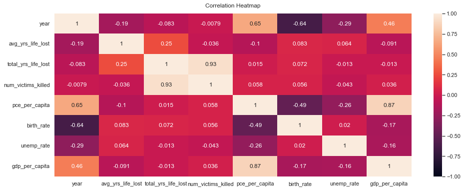
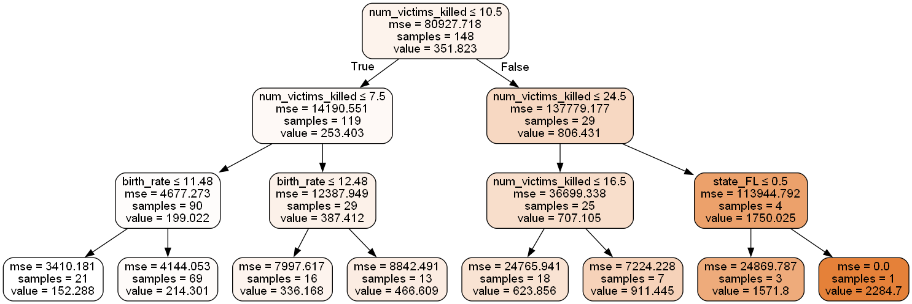
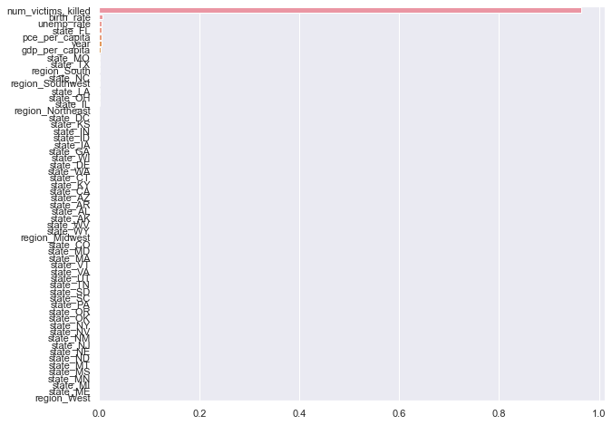

```python
import pandas as pd
import matplotlib.pyplot as plt
import seaborn as sns
import numpy as np
import scipy.stats as stats
import statsmodels.formula.api as sm
```


```python
df1 = pd.read_csv('yrs_lost_econ_data_viz.csv')
df1.head(10)
```


<div>
<style scoped>
    .dataframe tbody tr th:only-of-type {
        vertical-align: middle;
    }

    .dataframe tbody tr th {
        vertical-align: top;
    }

    .dataframe thead th {
        text-align: right;
    }
</style>
<table border="1" class="dataframe">
  <thead>
    <tr style="text-align: right;">
      <th></th>
      <th>year</th>
      <th>state</th>
      <th>avg_yrs_life_lost</th>
      <th>total_yrs_life_lost</th>
      <th>num_victims_killed</th>
      <th>region</th>
      <th>pce_per_capita</th>
      <th>birth_rate</th>
      <th>unemp_rate</th>
      <th>gdp_per_capita</th>
    </tr>
  </thead>
  <tbody>
    <tr>
      <th>0</th>
      <td>2006</td>
      <td>AZ</td>
      <td>53.21</td>
      <td>478.9</td>
      <td>9</td>
      <td>Southwest</td>
      <td>30543.0</td>
      <td>16.99</td>
      <td>4.3</td>
      <td>32227.81</td>
    </tr>
    <tr>
      <th>1</th>
      <td>2006</td>
      <td>CA</td>
      <td>48.31</td>
      <td>966.2</td>
      <td>20</td>
      <td>West</td>
      <td>32680.0</td>
      <td>15.61</td>
      <td>4.9</td>
      <td>39744.53</td>
    </tr>
    <tr>
      <th>2</th>
      <td>2006</td>
      <td>CT</td>
      <td>57.34</td>
      <td>286.7</td>
      <td>5</td>
      <td>Northeast</td>
      <td>38604.0</td>
      <td>11.89</td>
      <td>4.4</td>
      <td>49358.64</td>
    </tr>
    <tr>
      <th>3</th>
      <td>2006</td>
      <td>FL</td>
      <td>61.08</td>
      <td>244.3</td>
      <td>4</td>
      <td>South</td>
      <td>33104.0</td>
      <td>13.03</td>
      <td>2.5</td>
      <td>32636.88</td>
    </tr>
    <tr>
      <th>4</th>
      <td>2006</td>
      <td>GA</td>
      <td>50.11</td>
      <td>400.9</td>
      <td>8</td>
      <td>South</td>
      <td>28633.0</td>
      <td>16.23</td>
      <td>5.1</td>
      <td>35032.64</td>
    </tr>
    <tr>
      <th>5</th>
      <td>2006</td>
      <td>IA</td>
      <td>49.86</td>
      <td>249.3</td>
      <td>5</td>
      <td>Midwest</td>
      <td>27974.0</td>
      <td>13.61</td>
      <td>3.7</td>
      <td>33875.34</td>
    </tr>
    <tr>
      <th>6</th>
      <td>2006</td>
      <td>IN</td>
      <td>49.13</td>
      <td>736.9</td>
      <td>15</td>
      <td>Midwest</td>
      <td>27862.0</td>
      <td>14.00</td>
      <td>5.0</td>
      <td>32385.43</td>
    </tr>
    <tr>
      <th>7</th>
      <td>2006</td>
      <td>KS</td>
      <td>50.04</td>
      <td>500.4</td>
      <td>10</td>
      <td>Midwest</td>
      <td>29515.0</td>
      <td>14.83</td>
      <td>4.4</td>
      <td>32622.10</td>
    </tr>
    <tr>
      <th>8</th>
      <td>2006</td>
      <td>KY</td>
      <td>69.78</td>
      <td>279.1</td>
      <td>4</td>
      <td>South</td>
      <td>26454.0</td>
      <td>13.81</td>
      <td>5.7</td>
      <td>28723.81</td>
    </tr>
    <tr>
      <th>9</th>
      <td>2006</td>
      <td>LA</td>
      <td>36.65</td>
      <td>806.3</td>
      <td>22</td>
      <td>South</td>
      <td>27330.0</td>
      <td>14.73</td>
      <td>4.1</td>
      <td>38148.75</td>
    </tr>
  </tbody>
</table>
</div>


```python
corr = df1.corr(method='pearson')
plt.figure(figsize=(16, 6))
# Store heatmap object in a variable to easily access it when you want to include more features (such as title).
# Set the range of values to be displayed on the colormap from -1 to 1, and set the annotation to True to display the correlation values on the heatmap.
heatmap = sns.heatmap(corr, vmin=-1, vmax=1, annot=True)
# Give a title to the heatmap. Pad defines the distance of the title from the top of the heatmap.
heatmap.set_title('Correlation Heatmap', fontdict={'fontsize':12}, pad=12);
```


    

    


### Economic Data Linear Regeresion I


```python
formula2 = 'total_yrs_life_lost ~  gdp_per_capita + num_victims_killed + pce_per_capita + unemp_rate + pce_per_capita + state + region'

model2 = sm.ols(formula = formula2, data = df1).fit()
print(model2.summary())
```

                                 OLS Regression Results                            
    ===============================================================================
    Dep. Variable:     total_yrs_life_lost   R-squared:                       0.899
    Model:                             OLS   Adj. R-squared:                  0.878
    Method:                  Least Squares   F-statistic:                     42.64
    Date:                 Wed, 08 Feb 2023   Prob (F-statistic):           1.93e-95
    Time:                         13:45:32   Log-Likelihood:                -1790.9
    No. Observations:                  295   AIC:                             3686.
    Df Residuals:                      243   BIC:                             3877.
    Df Model:                           51                                         
    Covariance Type:             nonrobust                                         
    =======================================================================================
                              coef    std err          t      P>|t|      [0.025      0.975]
    ---------------------------------------------------------------------------------------
    Intercept              68.9686     95.483      0.722      0.471    -119.111     257.048
    state[T.AL]           -11.1558     44.239     -0.252      0.801     -98.296      75.984
    state[T.AR]           -62.6087     65.211     -0.960      0.338    -191.061      65.843
    state[T.AZ]           -63.2706     38.471     -1.645      0.101    -139.049      12.508
    state[T.CA]            11.6764     88.224      0.132      0.895    -162.104     185.457
    state[T.CO]           -42.3062    102.838     -0.411      0.681    -244.874     160.261
    state[T.CT]           146.4577     64.464      2.272      0.024      19.477     273.438
    state[T.DC]           402.5535    180.488      2.230      0.027      47.033     758.074
    state[T.DE]            68.2401     79.537      0.858      0.392     -88.430     224.910
    state[T.FL]            23.8022     55.840      0.426      0.670     -86.190     133.795
    state[T.GA]           -16.7488     36.585     -0.458      0.648     -88.813      55.316
    state[T.IA]            28.6798     78.817      0.364      0.716    -126.572     183.932
    state[T.ID]             4.4296    144.063      0.031      0.975    -279.342     288.201
    state[T.IL]            95.9581     35.588      2.696      0.008      25.858     166.059
    state[T.IN]            14.8999     39.176      0.380      0.704     -62.269      92.068
    state[T.KS]            -6.3492     50.671     -0.125      0.900    -106.161      93.462
    state[T.KY]           -55.3186     47.742     -1.159      0.248    -149.359      38.722
    state[T.LA]           -25.5995     46.564     -0.550      0.583    -117.321      66.122
    state[T.MA]            72.3937     57.701      1.255      0.211     -41.263     186.051
    state[T.MD]             3.8392     50.382      0.076      0.939     -95.403     103.081
    state[T.ME]           -26.4005    106.625     -0.248      0.805    -236.427     183.626
    state[T.MI]           -63.4463     42.710     -1.486      0.139    -147.574      20.682
    state[T.MN]            -4.2775     66.278     -0.065      0.949    -134.831     126.276
    state[T.MO]          -105.3474     39.185     -2.688      0.008    -182.532     -28.163
    state[T.MS]          -113.2894     58.227     -1.946      0.053    -227.984       1.405
    state[T.MT]            -8.6356    147.153     -0.059      0.953    -298.494     281.223
    state[T.NC]           -89.2821     42.815     -2.085      0.038    -173.618      -4.946
    state[T.ND]            52.8354     66.591      0.793      0.428     -78.334     184.005
    state[T.NE]           -82.3989    110.051     -0.749      0.455    -299.174     134.376
    state[T.NJ]           -16.8548     49.476     -0.341      0.734    -114.312      80.602
    state[T.NM]           -16.5586     48.942     -0.338      0.735    -112.962      79.845
    state[T.NV]          -161.7902    103.209     -1.568      0.118    -365.090      41.509
    state[T.NY]            45.9677     51.351      0.895      0.372     -55.182     147.117
    state[T.OH]            41.6395     33.455      1.245      0.214     -24.258     107.537
    state[T.OK]            66.2401     49.227      1.346      0.180     -30.725     163.206
    state[T.OR]           -15.7871     97.084     -0.163      0.871    -207.021     175.447
    state[T.PA]           -45.8038     45.837     -0.999      0.319    -136.092      44.485
    state[T.SC]           -97.3512     44.775     -2.174      0.031    -185.549      -9.154
    state[T.SD]            79.9628    109.509      0.730      0.466    -135.745     295.670
    state[T.TN]            -0.3360     38.449     -0.009      0.993     -76.071      75.399
    state[T.TX]             7.8124     34.660      0.225      0.822     -60.460      76.085
    state[T.UT]            14.2771    110.221      0.130      0.897    -202.834     231.388
    state[T.VA]            30.1265     45.570      0.661      0.509     -59.636     119.889
    state[T.VT]          -159.4307    109.174     -1.460      0.145    -374.479      55.618
    state[T.WA]             7.3744     89.019      0.083      0.934    -167.972     182.721
    state[T.WI]           -25.8953     42.707     -0.606      0.545    -110.019      58.228
    state[T.WV]           -54.7611     54.677     -1.002      0.318    -162.462      52.940
    state[T.WY]            81.8950    145.527      0.563      0.574    -204.760     368.550
    region[T.Northeast]    16.3293     36.775      0.444      0.657     -56.109      88.768
    region[T.South]         2.1103     19.350      0.109      0.913     -36.006      40.226
    region[T.Southwest]    -5.7766     21.937     -0.263      0.793     -48.987      37.433
    region[T.West]         30.0448     81.020      0.371      0.711    -129.546     189.636
    gdp_per_capita         -0.0058      0.003     -2.005      0.046      -0.011      -0.000
    num_victims_killed     41.9475      1.113     37.688      0.000      39.755      44.140
    pce_per_capita          0.0064      0.006      1.067      0.287      -0.005       0.018
    unemp_rate             -0.1547      3.839     -0.040      0.968      -7.717       7.408
    ==============================================================================
    Omnibus:                       52.350   Durbin-Watson:                   1.797
    Prob(Omnibus):                  0.000   Jarque-Bera (JB):              213.868
    Skew:                          -0.662   Prob(JB):                     3.62e-47
    Kurtosis:                       6.955   Cond. No.                     2.52e+17
    ==============================================================================
    
    Notes:
    [1] Standard Errors assume that the covariance matrix of the errors is correctly specified.
    [2] The smallest eigenvalue is 1.93e-23. This might indicate that there are
    strong multicollinearity problems or that the design matrix is singular.


```python
print("Mean Squared Error : " , model2.mse_resid)
print('Explained Variance : ', model2.rsquared)
```

    Mean Squared Error :  13325.624856362656
    Explained Variance :  0.8994811099530476


### Economic Data Linear Regression II (Cross Validation)


```python
import numpy as np
import pandas as pd
import statsmodels.api as sm
from sklearn.model_selection import KFold


# Encode the categorical variable using one-hot encoding
df = pd.get_dummies(df1, columns=['state','region'], drop_first=True)

# Split the data into predictor variables (X) and target variable (y)
X = df.drop('total_yrs_life_lost', axis=1)
y = df['total_yrs_life_lost']

# Initialize the KFold cross-validator
kf = KFold(n_splits=10)

# Initialize a list to store the cross-validation scores
scores = []

# Perform cross-validation
for train_index, test_index in kf.split(X):
    X_train, X_test = X.iloc[train_index], X.iloc[test_index]
    y_train, y_test = y.iloc[train_index], y.iloc[test_index]

    # Fit the OLS model on the training data
    model = sm.OLS(y_train, X_train).fit()

    # Predict on the test data
    y_pred = model.predict(X_test)

    # Calculate the mean squared error
    mse = np.mean((y_test - y_pred)**2)
    scores.append(mse)
```


```python
print(model.summary())
```

                                 OLS Regression Results                            
    ===============================================================================
    Dep. Variable:     total_yrs_life_lost   R-squared:                       0.961
    Model:                             OLS   Adj. R-squared:                  0.951
    Method:                  Least Squares   F-statistic:                     96.65
    Date:                 Wed, 08 Feb 2023   Prob (F-statistic):          1.21e-122
    Time:                         13:45:32   Log-Likelihood:                -1494.8
    No. Observations:                  266   AIC:                             3100.
    Df Residuals:                      211   BIC:                             3297.
    Df Model:                           54                                         
    Covariance Type:             nonrobust                                         
    ======================================================================================
                             coef    std err          t      P>|t|      [0.025      0.975]
    --------------------------------------------------------------------------------------
    year                   4.6113      6.037      0.764      0.446      -7.290      16.513
    avg_yrs_life_lost      6.6726      0.372     17.938      0.000       5.939       7.406
    num_victims_killed    42.7291      0.756     56.529      0.000      41.239      44.219
    pce_per_capita        -0.0027      0.008     -0.322      0.748      -0.019       0.014
    birth_rate            20.7775     12.438      1.671      0.096      -3.740      45.295
    unemp_rate             1.0355      3.365      0.308      0.759      -5.597       7.668
    gdp_per_capita         0.0002      0.002      0.076      0.940      -0.004       0.005
    state_AL            -614.8064    779.428     -0.789      0.431   -2151.271     921.658
    state_AR            -626.7246    788.014     -0.795      0.427   -2180.113     926.664
    state_AZ           -1941.5632   2398.057     -0.810      0.419   -6668.782    2785.656
    state_CA              42.6232     65.900      0.647      0.518     -87.284     172.530
    state_CO             -62.6289     79.589     -0.787      0.432    -219.519      94.262
    state_CT           -1089.2463   1484.023     -0.734      0.464   -4014.657    1836.164
    state_DC            -654.8748    669.145     -0.979      0.329   -1973.941     664.192
    state_DE            -622.5449    725.542     -0.858      0.392   -2052.785     807.695
    state_FL            -516.8020    726.131     -0.712      0.477   -1948.202     914.598
    state_GA            -622.1382    770.704     -0.807      0.420   -2141.405     897.128
    state_IA           -9775.6933    1.2e+04     -0.812      0.418   -3.35e+04     1.4e+04
    state_ID             -82.6659    125.247     -0.660      0.510    -329.561     164.230
    state_IL           -9724.9442    1.2e+04     -0.809      0.420   -3.34e+04     1.4e+04
    state_IN           -9768.0404   1.21e+04     -0.810      0.419   -3.35e+04     1.4e+04
    state_KS           -9759.2588   1.21e+04     -0.810      0.419   -3.35e+04     1.4e+04
    state_KY            -617.3181    772.151     -0.799      0.425   -2139.436     904.800
    state_LA            -603.7767    774.672     -0.779      0.437   -2130.866     923.312
    state_MA           -1193.4020   1476.382     -0.808      0.420   -4103.751    1716.947
    state_MD            -595.5313    722.307     -0.824      0.411   -2019.394     828.331
    state_ME           -1268.1228   1511.815     -0.839      0.403   -4248.319    1712.074
    state_MI           -9724.6572    1.2e+04     -0.808      0.420   -3.34e+04     1.4e+04
    state_MN           -9754.8871    1.2e+04     -0.812      0.418   -3.35e+04    1.39e+04
    state_MO           -9757.5512    1.2e+04     -0.810      0.419   -3.35e+04     1.4e+04
    state_MS            -627.1514    801.266     -0.783      0.435   -2206.663     952.360
    state_MT             -26.3065    110.805     -0.237      0.813    -244.734     192.121
    state_NC            -658.7576    765.432     -0.861      0.390   -2167.631     850.116
    state_ND           -9774.4254    1.2e+04     -0.813      0.417   -3.35e+04    1.39e+04
    state_NE           -9799.4420    1.2e+04     -0.814      0.417   -3.35e+04    1.39e+04
    state_NJ           -1245.3120   1499.804     -0.830      0.407   -4201.832    1711.208
    state_NM           -1925.3352   2413.417     -0.798      0.426   -6682.833    2832.163
    state_NV             -77.0770     85.258     -0.904      0.367    -245.144      90.990
    state_NY           -1265.8943   1516.268     -0.835      0.405   -4254.869    1723.080
    state_OH           -9721.7259    1.2e+04     -0.807      0.420   -3.35e+04     1.4e+04
    state_OK           -1952.7448   2425.303     -0.805      0.422   -6733.674    2828.185
    state_OR              28.1329     91.500      0.307      0.759    -152.238     208.504
    state_PA           -1239.4298   1516.222     -0.817      0.415   -4228.314    1749.454
    state_SC            -627.1194    761.165     -0.824      0.411   -2127.581     873.343
    state_SD           -9814.8315   1.21e+04     -0.814      0.416   -3.36e+04    1.39e+04
    state_TN            -625.0503    768.870     -0.813      0.417   -2140.701     890.601
    state_TX           -2008.0504   2412.700     -0.832      0.406   -6764.135    2748.034
    state_UT            -137.9201    123.071     -1.121      0.264    -380.527     104.687
    state_VA            -561.4291    735.368     -0.763      0.446   -2011.038     888.180
    state_VT           -1163.3386   1493.292     -0.779      0.437   -4107.022    1780.344
    state_WA              30.3268     71.723      0.423      0.673    -111.058     171.711
    state_WI           -9724.4774    1.2e+04     -0.808      0.420   -3.34e+04     1.4e+04
    state_WV            -570.5763    759.726     -0.751      0.453   -2068.203     927.050
    state_WY              32.0210    109.844      0.292      0.771    -184.512     248.554
    region_Northeast   -8464.7459   1.05e+04     -0.807      0.421   -2.91e+04    1.22e+04
    region_South       -9144.6010   1.13e+04     -0.810      0.419   -3.14e+04    1.31e+04
    region_Southwest   -7827.6936   9648.570     -0.811      0.418   -2.68e+04    1.12e+04
    region_West        -9772.5652    1.2e+04     -0.814      0.417   -3.34e+04    1.39e+04
    ==============================================================================
    Omnibus:                       90.745   Durbin-Watson:                   1.834
    Prob(Omnibus):                  0.000   Jarque-Bera (JB):             1213.033
    Skew:                          -0.943   Prob(JB):                    3.92e-264
    Kurtosis:                      13.290   Cond. No.                     1.04e+16
    ==============================================================================
    
    Notes:
    [1] Standard Errors assume that the covariance matrix of the errors is correctly specified.
    [2] The smallest eigenvalue is 9.63e-21. This might indicate that there are
    strong multicollinearity problems or that the design matrix is singular.


```python
# Calculate the mean score across all folds
mean_score = np.mean(scores)
print("Mean Squared Error:", mean_score)
print("Explained Variance: ",model.rsquared)
```

    Mean Squared Error: 88458.98873571095
    Explained Variance:  0.9611416391760504


### Economic Data Linear Regression III (Reduced model)


```python
formula1 = 'total_yrs_life_lost ~   gdp_per_capita + num_victims_killed ' # pce_per_capita + + unemp_rate + + pce_per_capita

model1 = sm.ols(formula = formula1, data = df1).fit()
print(model1.summary())
```

                                 OLS Regression Results                            
    ===============================================================================
    Dep. Variable:     total_yrs_life_lost   R-squared:                       0.874
    Model:                             OLS   Adj. R-squared:                  0.873
    Method:                  Least Squares   F-statistic:                     1014.
    Date:                 Wed, 08 Feb 2023   Prob (F-statistic):          3.65e-132
    Time:                         13:45:58   Log-Likelihood:                -1824.0
    No. Observations:                  295   AIC:                             3654.
    Df Residuals:                      292   BIC:                             3665.
    Df Model:                            2                                         
    Covariance Type:             nonrobust                                         
    ======================================================================================
                             coef    std err          t      P>|t|      [0.025      0.975]
    --------------------------------------------------------------------------------------
    Intercept             62.0287     21.961      2.825      0.005      18.807     105.250
    gdp_per_capita        -0.0009      0.000     -2.245      0.025      -0.002      -0.000
    num_victims_killed    42.4552      0.943     45.038      0.000      40.600      44.310
    ==============================================================================
    Omnibus:                       47.166   Durbin-Watson:                   1.780
    Prob(Omnibus):                  0.000   Jarque-Bera (JB):              281.720
    Skew:                          -0.429   Prob(JB):                     6.69e-62
    Kurtosis:                       7.710   Cond. No.                     1.69e+05
    ==============================================================================
    
    Notes:
    [1] Standard Errors assume that the covariance matrix of the errors is correctly specified.
    [2] The condition number is large, 1.69e+05. This might indicate that there are
    strong multicollinearity or other numerical problems.


```python
print("Mean Squared Error:", model1.mse_resid)
print("Explained Variance: ",model1.rsquared)
```

    Mean Squared Error: 13880.537796855286
    Explained Variance:  0.874181943488802


###  Random forest regressor


```python
df1 = pd.get_dummies(df1)
# Display the first 5 rows of the last 12 columns
df1.head(5)
```


<div>
<style scoped>
    .dataframe tbody tr th:only-of-type {
        vertical-align: middle;
    }

    .dataframe tbody tr th {
        vertical-align: top;
    }

    .dataframe thead th {
        text-align: right;
    }
</style>
<table border="1" class="dataframe">
  <thead>
    <tr style="text-align: right;">
      <th></th>
      <th>year</th>
      <th>avg_yrs_life_lost</th>
      <th>total_yrs_life_lost</th>
      <th>num_victims_killed</th>
      <th>pce_per_capita</th>
      <th>birth_rate</th>
      <th>unemp_rate</th>
      <th>gdp_per_capita</th>
      <th>state_AK</th>
      <th>state_AL</th>
      <th>...</th>
      <th>state_VT</th>
      <th>state_WA</th>
      <th>state_WI</th>
      <th>state_WV</th>
      <th>state_WY</th>
      <th>region_Midwest</th>
      <th>region_Northeast</th>
      <th>region_South</th>
      <th>region_Southwest</th>
      <th>region_West</th>
    </tr>
  </thead>
  <tbody>
    <tr>
      <th>0</th>
      <td>2006</td>
      <td>53.21</td>
      <td>478.9</td>
      <td>9</td>
      <td>30543.0</td>
      <td>16.99</td>
      <td>4.3</td>
      <td>32227.81</td>
      <td>0</td>
      <td>0</td>
      <td>...</td>
      <td>0</td>
      <td>0</td>
      <td>0</td>
      <td>0</td>
      <td>0</td>
      <td>0</td>
      <td>0</td>
      <td>0</td>
      <td>1</td>
      <td>0</td>
    </tr>
    <tr>
      <th>1</th>
      <td>2006</td>
      <td>48.31</td>
      <td>966.2</td>
      <td>20</td>
      <td>32680.0</td>
      <td>15.61</td>
      <td>4.9</td>
      <td>39744.53</td>
      <td>0</td>
      <td>0</td>
      <td>...</td>
      <td>0</td>
      <td>0</td>
      <td>0</td>
      <td>0</td>
      <td>0</td>
      <td>0</td>
      <td>0</td>
      <td>0</td>
      <td>0</td>
      <td>1</td>
    </tr>
    <tr>
      <th>2</th>
      <td>2006</td>
      <td>57.34</td>
      <td>286.7</td>
      <td>5</td>
      <td>38604.0</td>
      <td>11.89</td>
      <td>4.4</td>
      <td>49358.64</td>
      <td>0</td>
      <td>0</td>
      <td>...</td>
      <td>0</td>
      <td>0</td>
      <td>0</td>
      <td>0</td>
      <td>0</td>
      <td>0</td>
      <td>1</td>
      <td>0</td>
      <td>0</td>
      <td>0</td>
    </tr>
    <tr>
      <th>3</th>
      <td>2006</td>
      <td>61.08</td>
      <td>244.3</td>
      <td>4</td>
      <td>33104.0</td>
      <td>13.03</td>
      <td>2.5</td>
      <td>32636.88</td>
      <td>0</td>
      <td>0</td>
      <td>...</td>
      <td>0</td>
      <td>0</td>
      <td>0</td>
      <td>0</td>
      <td>0</td>
      <td>0</td>
      <td>0</td>
      <td>1</td>
      <td>0</td>
      <td>0</td>
    </tr>
    <tr>
      <th>4</th>
      <td>2006</td>
      <td>50.11</td>
      <td>400.9</td>
      <td>8</td>
      <td>28633.0</td>
      <td>16.23</td>
      <td>5.1</td>
      <td>35032.64</td>
      <td>0</td>
      <td>0</td>
      <td>...</td>
      <td>0</td>
      <td>0</td>
      <td>0</td>
      <td>0</td>
      <td>0</td>
      <td>0</td>
      <td>0</td>
      <td>1</td>
      <td>0</td>
      <td>0</td>
    </tr>
  </tbody>
</table>
<p>5 rows × 61 columns</p>
</div>


```python
# X = df1.drop(columns=['total_yrs_life_lost']) #'avg_yrs_life_lost',
# y = df1.total_yrs_life_lost 
X = df1.drop(columns=['total_yrs_life_lost','avg_yrs_life_lost']) 
y = df1.total_yrs_life_lost 
```


```python
from sklearn.model_selection import train_test_split
from sklearn.ensemble import RandomForestRegressor
from sklearn.metrics import mean_absolute_error,mean_squared_error,explained_variance_score, r2_score

X_train,X_test,y_train,y_test = train_test_split(X,y, test_size = 0.2, random_state = 0)
X_train.shape,X_test.shape,y_train.shape,y_test.shape

model = RandomForestRegressor(n_estimators= 30, random_state= 30, max_depth= 3)
rf = model.fit(X_train, y_train)


## train accuracy
y_train_pred = rf.predict(X_train)
print("The train MAE is %.2f"% mean_absolute_error(y_train,y_train_pred))
print("The train RMSE is %.2f"% mean_squared_error(y_train,y_train_pred)**0.5)
print("The train EVS is %.2f"% explained_variance_score(y_train,y_train_pred))

## test data accuracy
y_test_pred = rf.predict(X_test)
print("The test MAE is %.2f"% mean_absolute_error(y_test,y_test_pred))
print("The test RMSE is %.2f"% mean_squared_error(y_test,y_test_pred)**0.5)
print("The test EVS is %.2f"% explained_variance_score(y_test,y_test_pred))

```

    The train MAE is 75.30
    The train RMSE is 102.54
    The train EVS is 0.90
    The test MAE is 83.14
    The test RMSE is 127.90
    The test EVS is 0.88


```python
from sklearn.tree import plot_tree
import matplotlib.pyplot as plt
from sklearn.tree import export_graphviz
import pydotplus
from IPython.display import Image
import graphviz
```


```python
import os
os.environ["PATH"] += os.pathsep + 'C:/Program Files/Graphviz/bin' 
```


```python

# # Visualize the first tree in the Random Forest
# tree_index = 2
# plt.figure(figsize=(20,10))
# plot_tree(rf.estimators_[tree_index], feature_names=X.columns, filled=True)
# plt.show()
```


```python
# Create the DOT file for the decision tree
dot_data = export_graphviz(rf.estimators_[3], out_file=None, feature_names=X.columns, filled=True, rounded=True, special_characters=True)

# Visualize the decision tree
graph = pydotplus.graph_from_dot_data(dot_data)
Image(graph.create_png())
```


    

    


```python
importance = rf.feature_importances_
indices = np.argsort(importance)[::-1]
feature_names = X.columns[indices]

sns.set(rc={'figure.figsize':(10,8)})
sns.barplot(x=importance[indices], y=feature_names) 

plt.show()
```


    

    


```python

```
